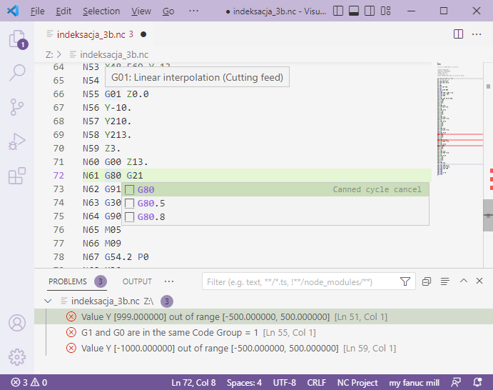
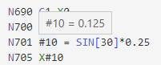
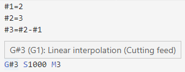
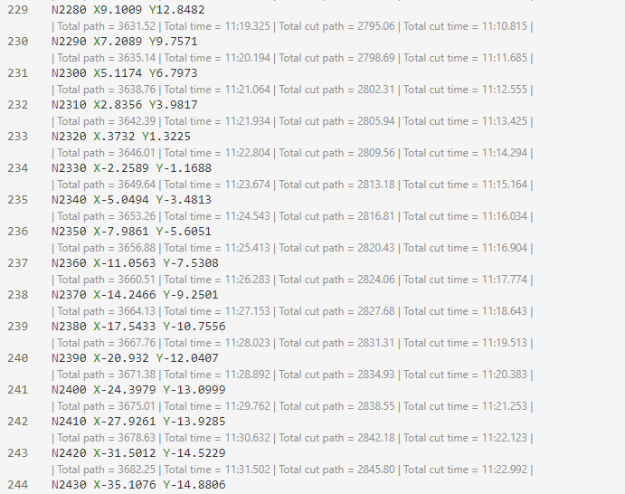
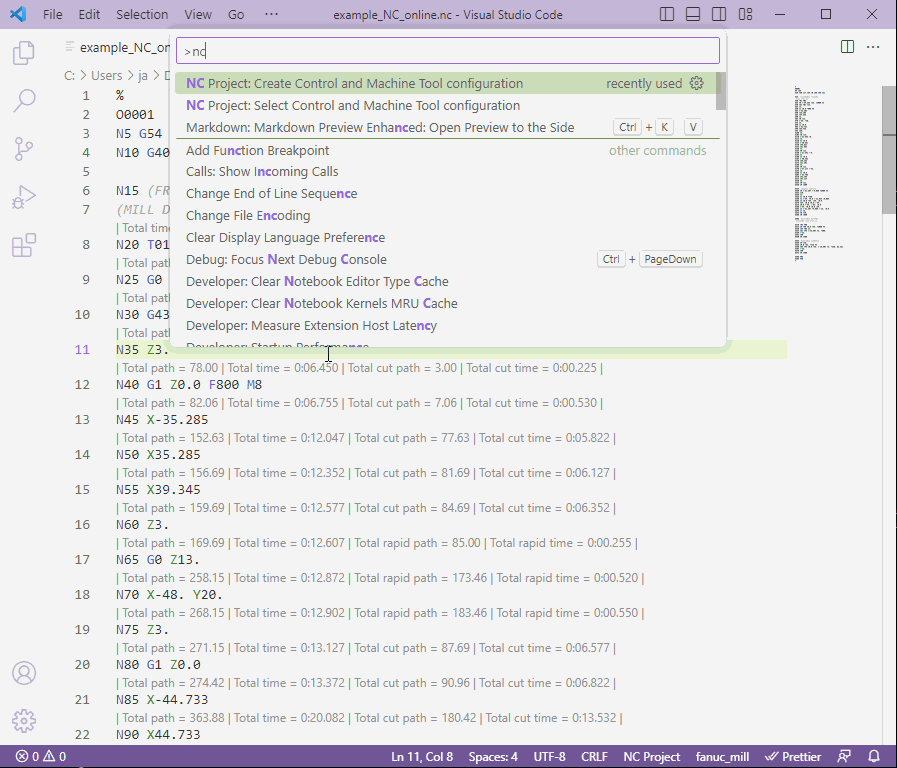
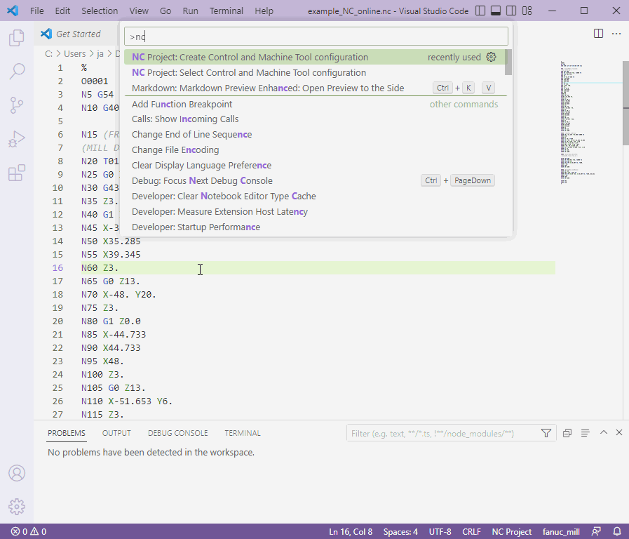

# NC Project extension for Visual Studio Code

Develop and validate CNC programs.

## News

- Version 0.4.1 released
  - New Features
  - Enhancements
    - Fanuc Turn & Mill Machines configurations updated
  - Bug fixes

## Features

- Support for Mill, Lathe and Turn & Mill Machines
- Code correctness and Code Groups validation
- Code completion for G/M codes
- Hovers for G/M codes, macro values and G/M codes with macros (i.e. G#1)

  
  
- Code Lens showing computed path and time for given line of CNC code
  Switch to toggle Code Lens: "NC Project: Toggle Path and Time Calculation"
  
- Machine Tool and Driver configuration creation/selection
- Syntax coloring
- Status bar
- Commands

## Current supported file extensions

".nc", ".txt", ".ptp", ".dat", ".mcd", ".spf", ".001", ".cnc", ".dnc", ".eia", ".fan", ".fnc", ".g", ".g00", ".gcode", ".iso", ".lib", ".min", ".ncl", ".out", ".pm", ".prf", ".prg", ".pu1", ".sub", ".tap", ".tp"

If you would like another file extension supported by this extension, please open an [issue](https://github.com/jmr1/vscode-ncproj/issues).

## Usage

Install & activate extension. Extension activates when you open a supported extension file

## Configuring extension

### Create machine tool and driver configuration

### Select machine tool and driver configuration

## Known Issues

Please visit [GitHub Issues](https://github.com/jmr1/vscode-ncproj/issues) page for any open issues.

## Troubleshooting

### Extension does not seem to work

Installation of Microsoft Visual C++ Redistributable packages for Visual Studio 2019 may be required: <https://aka.ms/vs/17/release/vc_redist.x64.exe>

#### Further troubleshooting

Navigate to: "%USERPROFILE%\\.vscode\extensions"
Then navigate to extension binaries folder: jrupar-mcieslik.ncproj-0.0.1\vscode-client\out
Execute: nclangsrv.exe
Watch for any errors.

### Machine Tool and Driver configuration GUI window does not start

Installation of .NET Framework 4.5 redistributable may be required.

#### Further troubleshooting

Navigate to: "%USERPROFILE%\\.vscode\extensions"
Then navigate to extension binaries folder: jrupar-mcieslik.ncproj-0.0.1\vscode-client\out
Execute: cmtconfig.exe
Watch for any errors.

## Contributors

- Janusz Rupar ([@jmr1](https://github.com/jmr1))
- Marcin Cieślik ([@marcin-975](https://github.com/marcin-975))

## License

This extension is licensed under the [MIT License](LICENSE).
